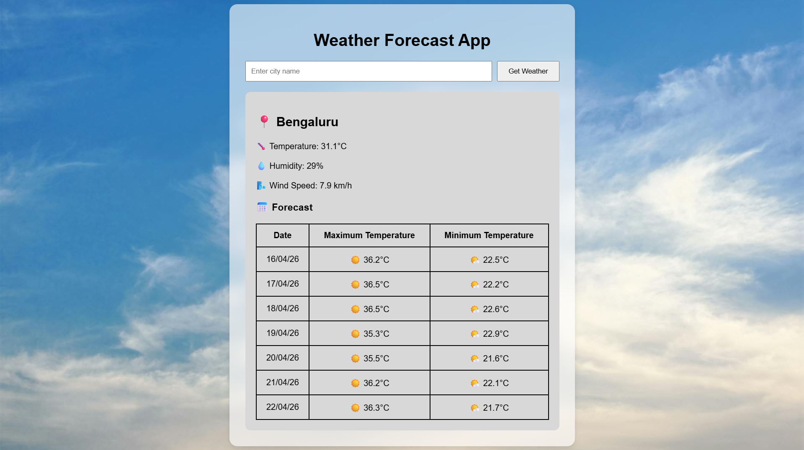

# Weather Forecast App

A weather forecasting web application built using Python, Flask, HTML, and CSS.

This app allows users to search for any city and view:
- Previous 2 days weather
- Current weather
- Next 5 days forecast
- Temperature, humidity, and wind speed
- Forecast data in a clean table format

---

## Features

- Search weather by city name
- Displays current temperature, humidity, and wind speed
- Shows previous day's. today's and next 5 days' weather forecast
- Forecast displayed in a structured table
- Weather emojis for better visual experience
- Custom date formatting (DD/MM/YY)
- Beautiful weather-themed UI
- Background image support
- Flask web app with HTML and CSS frontend

---

## Technologies Used

- Python
- Flask
- HTML
- CSS
- Requests Library
- JSON
- Open-Meteo API
- VS Code
- Git and GitHub

---

## API Source

This project uses the free Open-Meteo APIs:

- Geocoding API
- Weather Forecast API

API Website:
https://open-meteo.com/

---

## Project Structure

```text
weather-app/
│
├── app.py
├── main.py
├── templates/
│   └── index.html
├── static/
│   ├── style.css
│   └── background.jpg
├── README.md
├── .gitignore

---
```

## How to Run the Project

1. Clone the repository

```bash
git clone https://github.com/yourusername/weather-forecast-app.git
```
2. Open the project folder

```bash
cd weather-app
```
3. Install required libraries

```bash
pip install flask requests
```
4. Run the Flask app

```bash
python app.py
```

5. Open your browser and go to http://127.0.0.1:5000


## Screenshot


